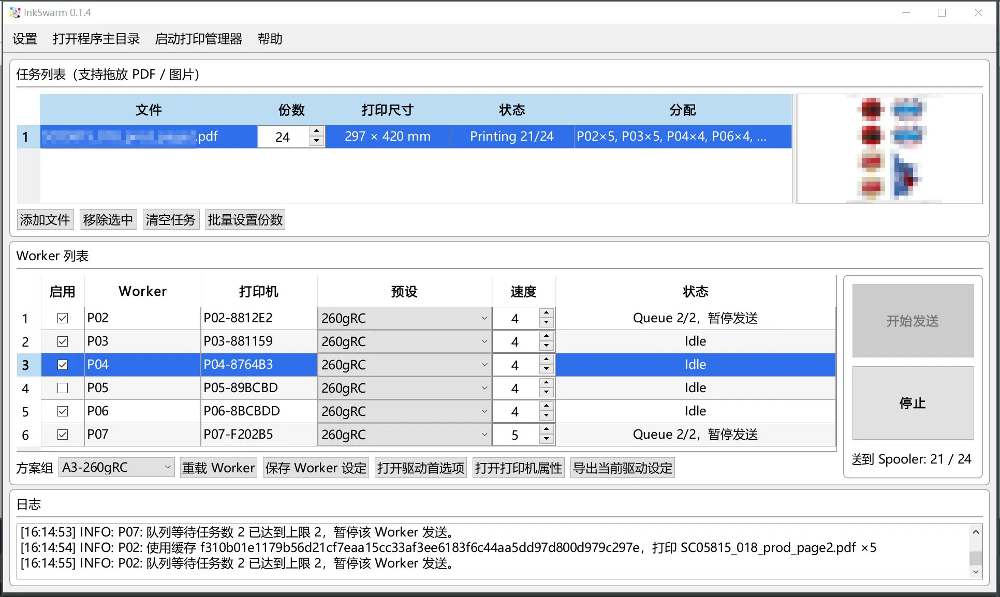
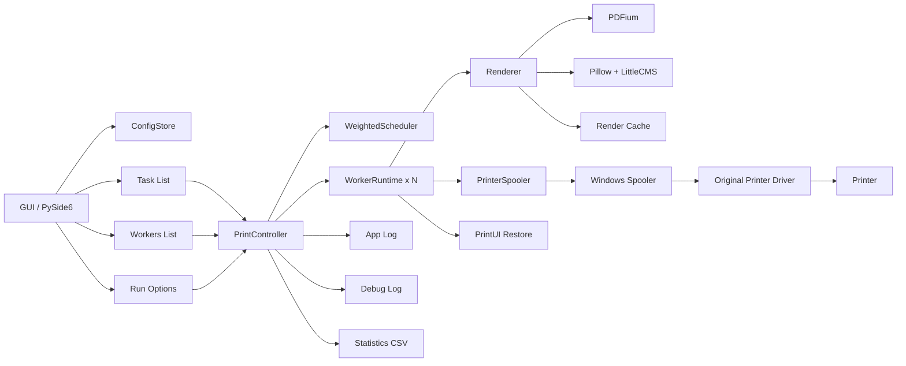

# InkSwarm

InkSwarm 是一个面向 Windows 的多打印机调度与色彩管理工具，目标不是替代打印机驱动，而是把 **任务分发、ICC 色彩转换、驱动预设恢复、缓存复用、日志追踪** 这些环节组织成一个稳定、可控、适合生产环境的打印流水线。

它特别适合这样一类场景：同一批 PDF 或图片需要发往多台桌面打印机并行输出，但又不能牺牲驱动层的纸张、墨水、介质、打印质量等原厂控制能力。InkSwarm 让你继续使用原厂驱动，同时把多机负载均衡、色彩管理和运行监控统一收口到一个 GUI 程序里。



## 亮点

- **多 Worker 并行调度**：按“速度”比例自动分配任务份数，同时保持发送顺序轮询，不让其他机器空等。
- **保留原厂驱动能力**：纸张、介质、打印质量、双向校准等仍交给打印机驱动处理。
- **ICC 色彩管理**：支持输入/输出 ICC、渲染意图、黑点补偿，适合不同机型、纸张、墨水组合。
- **同任务只 RIP 一次**：同一个 Worker 处理同一个任务时只渲染一次并复用缓存，避免重复开销。
- **面向生产环境的防护**：支持自动清缓存、队列上限限流、RIP 精度限制、忽略页边距、按月统计输出结果。
- **可追踪性强**：普通日志、debug 日志、统计 CSV 分层记录，便于长期运行和问题排查。

## 为什么做这个项目

现成的批量打印方案在“多机并发 + 色彩管理 + 原厂驱动兼容性”这个组合场景下并不理想。

一类方案擅长批量投递，但对不同打印机、不同纸张墨水组合的色彩管理支持不足。另一类方案虽然能做 ICC 转换，但常常把整条链路绑死在自己的渲染和发送方式上，稳定性、性能、可维护性都不够理想，尤其是在多台打印机并发工作时容易暴露问题。

InkSwarm 的思路是把问题拆开：

- **调度** 由程序自身负责。
- **色彩管理** 由可控的渲染链完成。
- **纸张和驱动细节** 交还给原厂驱动。
- **重复任务** 通过缓存复用避免重复 RIP。

这样做的结果是，既能保留生产环境里最关键的驱动兼容性，又能获得独立、透明、可扩展的任务调度能力。

## 技术栈与架构图

### 技术栈

- **GUI**：PySide6
- **PDF 渲染**：pypdfium2 / PDFium
- **位图与 ICC 处理**：Pillow + ImageCms（LittleCMS）
- **Windows 打印接口**：pywin32（Printer DC / Spooler）
- **驱动预设保存与恢复**：PrintUI / `.dat` 快照
- **缓存与配置**：本地目录结构 + JSON
- **日志与统计**：文本日志、debug 日志、按月 CSV

### 架构图



## 快速上手

1. 安装 Python 和依赖。
2. 启动程序，准备好程序根目录下的 `Workers` 或 `Workers_*` 方案组目录。
3. 为每个 Worker 配置打印机名称、速度、当前预设。
4. 在对应 preset 中放入 ICC、驱动快照或其他预设文件。
5. 通过 GUI 打开驱动首选项，确认纸张和介质参数，然后导出当前驱动设定。
6. 将 PDF 或图片拖入任务列表，设置份数。
7. 在设置面板中按需要启用自动清缓存、自适应纸张方向、忽略页边距、RIP 精度限制、Worker 最大排队数等选项。
8. 点击“开始发送”，由调度器按 Worker 速度和当前状态并行分发任务。

## 功能介绍

### 任务列表

任务列表是 InkSwarm 的入口区域。每个条目对应一个独立打印任务，核心字段包括：

- 文件名
- 份数
- 打印尺寸
- 当前状态
- 分配摘要

任务支持拖放添加，份数可以逐项修改，也可以批量修改。程序会根据当前启用的 Worker 和速度参数，为每个任务先计算应分配到各台机器的份数，再交给调度器按轮询顺序发出。

列表右侧会显示当前选中任务的缩略图，用于快速核对内容方向和大致版式。

### 输入文件处理

InkSwarm 支持常见的生产输入类型：

- PDF
- JPG / JPEG
- PNG
- TIFF / TIF
- BMP

程序会先读取输入文件的物理尺寸信息，用于后续 1:1 输出。对于位图输入，会根据图像内 DPI 换算毫米尺寸；缺失 DPI 时则使用默认值估算。对于 PDF，则直接读取页面尺寸。

为了降低资源占用并避免大图导致的渲染/发送不稳定，程序提供 **RIP 精度限制**。启用后：

- PDF 渲染 DPI 会被限制在指定上限以内。
- 位图如果超过目标物理尺寸对应的最大像素数，也会在进入缓存前缩小到上限。

程序还支持 **自适应纸张方向**：

- 可强制统一为 Portrait 或 Landscape。
- 不管输入文件本身方向如何，都会在缓存生成阶段统一旋转到目标朝向。

### 色彩管理

色彩管理是 InkSwarm 的核心功能之一。每个 Worker 的 preset 都可以定义自己的色彩链路，包括：

- 输入 ICC
- 输出 ICC
- 渲染意图
- 黑点补偿

基本规则如下：

- **RGB 输入没有 ICC 时**，按 `sRGB` 处理。
- **CMYK 输入没有 ICC 时**，直接拒绝处理，避免错误解释色彩空间。
- 输出侧统一转换到驱动更容易接受的工作结果，再交给打印机驱动继续处理纸张、墨水和介质逻辑。

这使得同一批任务可以针对不同机型、不同纸张、不同墨水方案，走不同的 preset 和 ICC 组合，而不需要为每一台机器维护完全独立的上游文件。

### Workers列表

Workers 列表定义了实际参与生产的输出节点。每个 Worker 本质上对应一台打印机加一组运行参数，主要包括：

- 是否启用
- Worker 名称
- 打印机名称
- 当前 preset
- 速度
- 状态

其中“速度”并不是抽象权重，而是一个直接可理解的相对产能参数。你可以把它理解为“单位时间能完成的张数”。

例如：

- A 机速度 = 25
- B 机速度 = 5

那么 30 份任务会被分配成约 25 : 5，整体完成时间更接近各机同时结束，而不是某台机器明显拖尾。

InkSwarm 还支持 **Workers 方案组**：

- 程序根目录下所有 `Workers`、`Workers_*` 目录都可以作为独立方案组。
- 不同方案组可以对应不同纸张、不同介质、不同机群配置。
- GUI 中可以快速切换当前方案组。

### 打印机驱动设定

InkSwarm 不试图取代打印机驱动的复杂参数，而是与驱动协同工作。

你可以在 GUI 中：

- 打开驱动首选项
- 打开打印机属性
- 导出当前驱动设定

导出的驱动设定会保存为 PrintUI 的 `.dat` 快照文件，并绑定到当前 preset。真正发送任务前，程序会先恢复对应的驱动快照，再执行打印动作。这样做有两个直接好处：

1. 不同 preset 可以对应不同纸张/介质/质量设定。
2. 即便多个 Worker 指向相似机型，也能保持独立、明确、可复现的驱动状态。

在设置面板中还提供 **忽略页边距** 选项。启用后，程序会尽量按整张物理纸面定位，不再主动为了打印机报告的不可打印边距留白，让满版设计更接近预期输出。

### 缓存

缓存机制是 InkSwarm 性能设计的重点。

对于同一个 Worker 处理同一个任务：

- 只会执行一次渲染与色彩转换。
- 渲染结果保存到本地缓存目录。
- 后续同任务的多份输出直接复用缓存，不再重复 RIP。

缓存 key 会综合以下因素生成：

- 输入文件签名
- Worker 名称
- preset 内容
- 方向选项
- RIP 精度限制

因此，只要其中任一关键条件变化，程序就会自动生成新的缓存，不会误用旧结果。

这个机制不仅节省 CPU 和内存，也显著减少了重复色彩转换和重复 PDF 渲染带来的不稳定因素。

### 日志系统

InkSwarm 的日志分成三层，各自职责不同。

#### 1. 普通运行日志

保存于 `logs/` 目录，记录：

- 调度摘要
- Worker 状态变化
- 缓存使用情况
- 流程开始与结束
- 成功/失败任务统计

它的目标是让操作者看得懂当前系统正在做什么，而不是堆满底层细节。

#### 2. Debug 日志

同样位于 `logs/` 目录，文件名为 `debug.log`。程序每次启动时会清除上一次的 `debug.log`，重新开始记录。

Debug 日志会写入更底层的信息，例如：

- 应用启动参数
- 设置读取结果
- 渲染缓存命中与重建
- ICC 转换链路
- 最终缓存图像尺寸
- 打印时的目标绘制尺寸与矩形
- 线程异常与未捕获异常
- Qt 消息

这份日志主要用于排查生产环境中的偶发问题和底层异常。

#### 3. 统计日志

程序还会在 `statistics/` 目录下按月生成 CSV，例如：

```text
statistics/2026-04.csv
```

统计文件只记录**已经成功发送完成**的任务条目，字段包括：

- 任务启动时刻（精确到秒）
- 文件名
- 文件数量

它按任务列表条目逐行记录，而不是按 Worker 维度拆分。也就是说，一个列表里有 3 个文件，最终统计就是 3 行。

为防止断电或崩溃导致统计文件损坏，CSV 采用**原子替换**方式落盘，而不是直接 append。这样即使在意外中断时，也更容易保住旧文件的完整性。

---

InkSwarm 当前已经具备生产可用的基本形态，但它依然保持着一个很清晰的目标：

**把复杂、多机、可控的打印流程，尽量变成一条稳定、透明、容易排查的生产链。**
